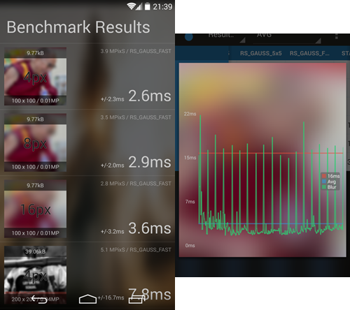
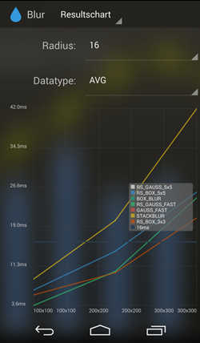
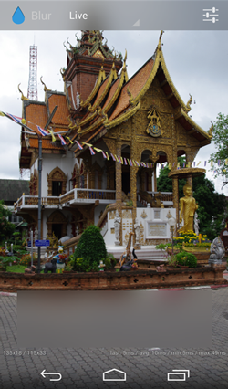
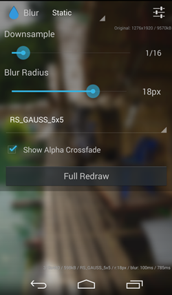

Blur Benchmark & Showcase for Android
===============

This is a simple benchmark and showcase app on whats possible with blurring in Android 2014. Noteably this app uses Android's Renderscript v8 support library for fast blurring.

Download App
-------------

The app is in the playstore, you can get it here https://play.google.com/store/apps/details?id=at.favre.app.blurbenchmark. Sorry because of the size, but many high res pictures are included ;)

Blur Benchmark
------------
Here you chose, the image sizes, blur radii and algorithm you want to benchmark. Finally you decide the accuarcy by providing the rounds each setting (image, radius, algorithm) is blurred. Be warned, some java implementations are very slow, so you could wait a bit with a high round count.

After running some benchmaks you see the results list, where you can click on each element and see a diagramm on the length of each round. This also reveals that this benchmark is polluted by garbage collection

Later you can examine the latest runs in a table view or comparative in a diagram with diffrent options on the values to see.

Details on the Benchmark
-----------
A Benchmark consists of blurring a single image a defined number of rounds with a certain pixel radius. Each benchmark has a warmup
phase of a couple of rounds to "warmup" the vm (as recommended here [How do I write a correct micro-benchmark in Java?](http://stackoverflow.com/questions/504103)). The time of each round will
be measured in nanoseconds (if the SDK API Level allows it, else ms). Altough it was taken care of to not recreate expensive objects (bitmap)
every benchmark, the noise of garbage collection is visible especially in the faster runs. So if you see 15-30 ms spikes, this is garbage collection.
The time of each round will be saved and from this data certain simple statistic can be calculated, like average and 95% confidence intervalls.

Here are the explanations of misc. values

* MPixel/s - the theoretical average performance without taking picture size into consideration, similar to the fillrate of a graphicscard (image width * height / average runtime in sec * 1000)
* Over 16ms - percentage of rounds that were "too slow" for live blurring, eg. slower than 16ms
* 95% [Confidence Intervall](https://en.wikipedia.org/wiki/Confidence_interval) - the average +/- the deviance that has 95% of the values
* [Median](https://en.wikipedia.org/wiki/Median) -  the numerical value separating the higher half of a data sample from the lower half

Live Blur
------------
This is a viewpager with a life blur under the actionbar and on the bottom. Live blur means, that blur views get updated
when the view changes (so viewpager, listview or scrollview gets scrolled). There are also diffrent settings, where you can change the algorithm, blur radius and and sample size (the higher, the smaller the used image).

How is this done?

Well, everytime the blur gets updated, the view will be drawn onto a bitmap (over a canvas) scaled according to the sample size, then cropped, blurred and set as background to the two views.

How can this be reasonable fast?

* use scaled down version of your view
* bitmap reference is reused to possible prevent some gc
* it has to be on the main thread, any multi threading (even with threadpool) is too slow (meaning the blur view lags behind a good 300ms) probably because of context switching

All in all this can be tweaked so that the blur method only takes around 8-10ms on most devices (with sample settings) which is the targeted runtime for smooth live blurring.
For more tips check out the [stack overflow post I did on this topic](http://stackoverflow.com/a/23119957/774398)

Static Blur
------------
This is a simple showcase to check out the different settings (blur radius, algorithm and sample size) and choose the best option for you (quality vs. performance). When pressing "Full redraw" it features a simple alpha blend from sharp to blur.

Explanation of Blur Algorithms (and credits)
------------

* RS_GAUSS_FAST is [ScriptIntrinsicBlur](http://developer.android.com/reference/android/renderscript/ScriptIntrinsicBlur.html) from the Renderscript framework - the default and best/fastest blur algorithm on android
* RS_BOX_5x5,RS_GAUSS_5x5 are convolve matrix based blur algorithms powerd by Renderscripts [ScriptIntrinsicConvolve](http://developer.android.com/reference/android/renderscript/ScriptIntrinsicConvolve5x5.html) class. The only difference are the used kernels (gaussian matrix and average matrix) of [convolve matrix](http://en.wikipedia.org/wiki/Kernel_(image_processing)). Instead of radius it uses passes, so a radius parameter of 16 makes the convolve algorithm applied 16 times onto the image.
* STACKBLUR found [here](http://www.quasimondo.com/StackBlurForCanvas/StackBlurDemo.html) and a [java implentation from github Yahel Bouaziz](https://github.com/PomepuyN/BlurEffectForAndroidDesign/blob/master/BlurEffect/src/com/npi/blureffect/Blur.java)
* RS_STACKBLUR is the Renderscript implementation of Stackblur from [here](https://github.com/kikoso/android-stackblur/blob/master/StackBlur/src/blur.rs)
* GAUSS_FAST java implementation from [here](http://stackoverflow.com/a/13436737/774398). Fast but ignores edges.
* BOX_BLUR java implementaiton from  [here](http://stackoverflow.com/questions/8218438). Really slow and under average visual quality.

Extra Credits
------------

* This project uses a gradle converted version of BraisGabin's project [TableFixHeaders](https://github.com/InQBarna/TableFixHeaders)